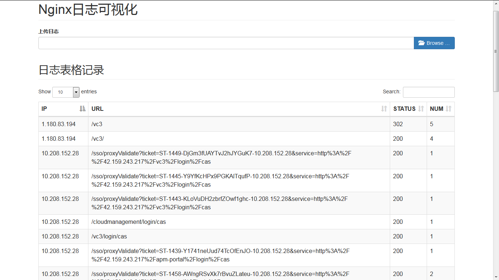
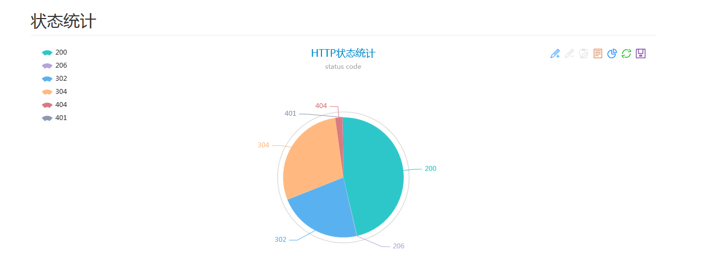
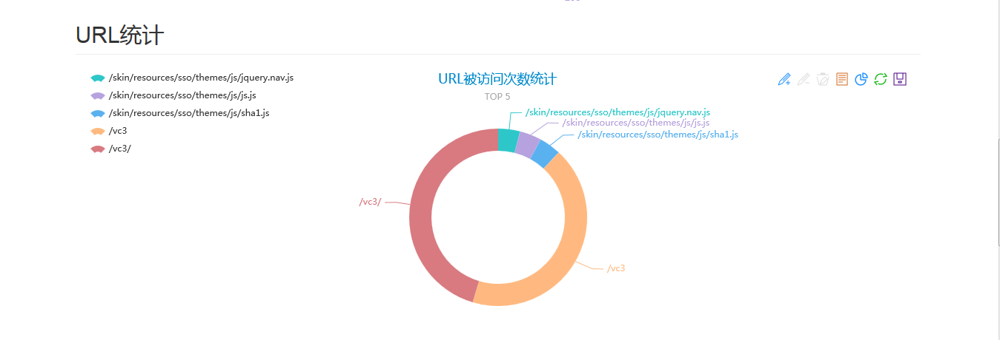
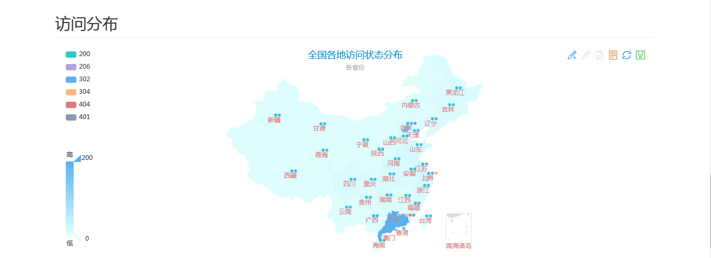

#简介

>Nginx日志可视化

  1.日志筛选格式化为表格
  2.访问数据视图分析

##运行测试
>编辑 `config.py` 写入`mysql`数据库配置,因为导入log后需要把分析数据写入`table`.

```bash
git clone https://github.com/lioncui/nginx-logvisual.git
cd nginx-logvisual
python manage.py create_all
python manage.py runserver
```

##Demo



